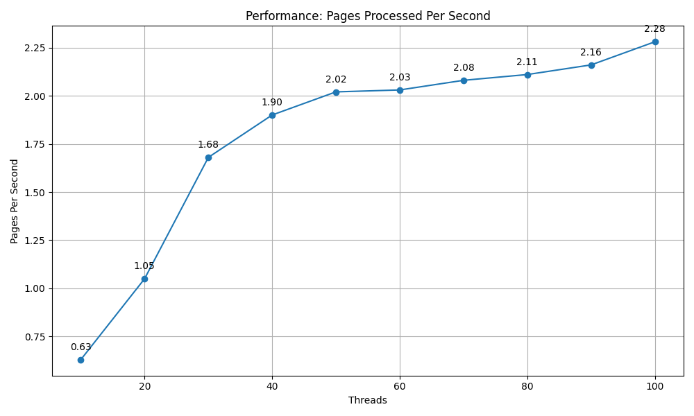
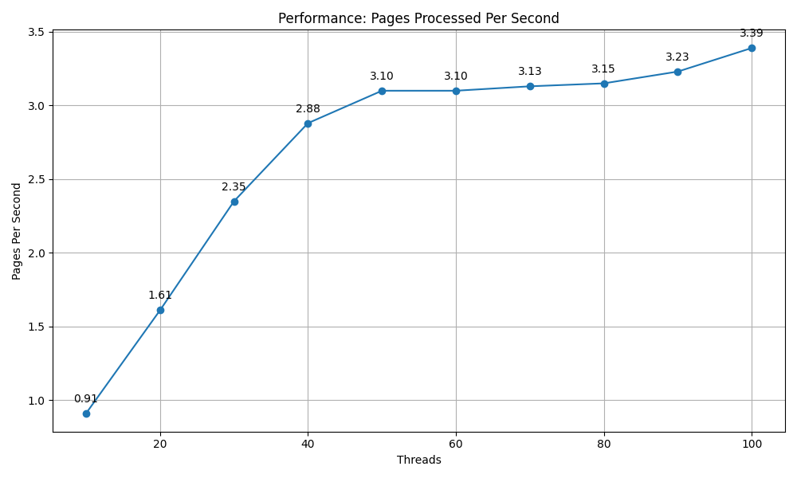

# qwen72b with flash-attn2 and vllm

## 下载模型文件

首先去官网找到`qwen-72b-instruct`的模型文件 https://modelscope.cn/models/Qwen/Qwen2.5-72B-Instruct/files。
按照官网右侧提供的方法：

1. `pip install modelscope`, 然后用`modelscope`下载模型文件
2. `git` 下载，但是要先安装`lfs`

## 创建虚拟环境

使用conda 创建`python=3.12`的虚拟环境，然后激活

```shell
conda create -n qwen2572b-py12 python=3.12
conda activate qwen2572b-py12
```

## 安装依赖

依赖一共分为4个：

1. vllm
2. flash-attn (V2版本)
3. cuda-toolkit
4. flashinfer-python

以下是步骤

```shell
pip install vllm==0.8.4
pip install flash-attn==2.7.4.post1
conda install nvidia/label/cuda-12.4.0::cuda-toolkit
pip install flashinfer-python==0.2.2.post1  -i https://flashinfer.ai/whl/cu124/torch2.6
```

> 上述步骤中，`flashinfer-python` 如果加代理下载可能很慢，这时可以先手工下载到本地，然后使用`pip install <your-whl-file.whl>` 安装。

## 启动http服务

利用slurm启动http服务，脚本已经封装好。现在假设你的模型放在`/home/user/model/qwen-72b-instruct`，那么启动http服务的命令如下：

```shell
cd /home/user/model/
sbatch start-72b.sh
```

> 启动之后，服务器的地址会在`qwen_server.log ` 中看到

## 测试

```python
from openai import OpenAI
openai_api_key = "EMPTY"
openai_api_base = "http://ip:port/v1"

client = OpenAI(
    api_key=openai_api_key,
    base_url=openai_api_base,
)

chat_response = client.chat.completions.create(
    model="Qwen2.5-72b",
    messages=[
        {"role": "system", "content": "You are Qwen, created by Alibaba Cloud. You are a helpful assistant."},
        {"role": "user", "content": "Tell me something about large language models."},
    ],
    temperature=0.7,
    top_p=0.8,
    max_tokens=512,
    extra_body={
        "repetition_penalty": 1.05,
    },
)
print("Chat response:", chat_response)
```

> 其中`model="Qwen2.5-72b"` 是vllm的模型名称，是启动`vllm server <model-name>` 时指定的模型名称(其实就是模型文件路径）。

## 性能参考

4卡A100-80G


8卡A100-80G

